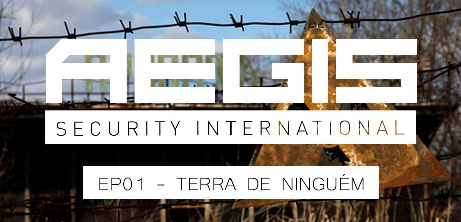

# 
Primeiro episódio da campanha em Esseker.

# 
Serguey Simonovoti responsável pelos setores de segurança, transporte de matéria e assuntos extra oficiais da Estatal Russa ROSATOM entrou em contato com a central de inteligência AEGIS afim de contratar os serviços da empresa para localizar e recuperar um lote de matéria roubada. A matéria roubada é um carregamento de U-235 altamente enriquecido por uma nova técnica de enriquecimento a laser, o comboio se destinava a usina flutuante Akademik Lomonosov dvukh a segunda de 10 planejada pelo governo russo até 2019.

Com toda a instabilidade do cenário global e a rejeição de programas nucleares após o acidente de Fukushima, a noticia de que uma grande quantidade de material radioativo altamente enriquecido por técnicas ainda não aprovadas pelo Conselho Mundial de Energia Nuclear está sobre as mãos grupos extremista pode gerar grande pressão da OTAN sobre os métodos que a Rússia vem utilizando para enriquecer urânio.

Serguey Simonovoti acredita que o roubo do material foi feito por uma divisão extremista da máfia russa conhecia como Bratva (Os Chapas) e que o material tenha sido levado para alguma base dos extremistas na Zona de Exclusão de Chernobyl. Essa Zona de Exclusão contempla um raio de 30 Kilometros ao redor da Usina, a área tem seu acesso controlado pelo exército Russo e Ucraniano. Contudo, como uma espécie de "santuário" a área é um verdadeiro deserto, já que a radioatividade segue afetando a natureza ali e afastando os curiosos. O que torna o local um ambiente propicio para organizações criminosas se esconderem e estabelecerem suas bases, uma vez que as patrulhas das forças armas não são tão eficientes (corrompíveis).

A CIA e o FBI têm feito conexões entre os Bratva e armas fornecidas para o armamento utilizado por grupos terroristas no Oriente Médio. Esse é provavelmente o principal motivo que fez com que nosso cliente nos procurasse. Apesar da ROSATON ser uma empresa estatal Serguy deixa bem claro que esta notícia não pode vazar e chegar aos ouvidos do governo ou do exército pois isso refletiria diretamente em toda a troca da equipe de alta segurança e assuntos extra oficiais, afetaria até mesmo a presidência da empresa e essas pessoas sabem demais para simplesmente serem desativadas de suas funções.

Seguindo os indícios apontados pelo cliente, Corona (Inteligência AEGIS) realizou uma busca com o satélite de suporte Hannibal-6 e constatou grande movimentação de caminhões ao sul da Zona de exclusão entre Pripyat e Kiev região conhecida como Esseker. Corona esta enviando equipe (Kaiser) de busca para o local para inicializar as investigações. Como o assunto é de alto sigilo e a entrada na ZE é restrita, Kaiser partirá para o local no próximo sábado em um voo civil e realizara um salto de paraquedas sobre a região. AEGIS não possui nenhuma sede na região devido ao governo Russo ser muito fechado e gostarem de resolver seus assuntos ao seu próprio modo, sendo assim, uma vez em solo Kaiser deve encontrar Alexei Drovanov um antigo contato da companhia que irá fornecer armamento e algum suporte.

INTEL:
A região de Esseker possui uma grande escasses de energia elétrica devido ao fato de que maior parte da regão está contida na Zona de Exclusão. O motivo de ainda haver energia na áera são alguns postos avançados do exercito Russo onde há algumas baterias anti-aéreas que asseguram a não penetração do espaço aéreo por aeronaves não autorizadas. Afim de estabelecer uma pequena base para servir de suporte a equipe Kaiser deve desativar 3 tranformadores da Usina que fornece energia para região. Essa usina está localizada na pequena cidade de Kula, a desativação dos trafos acarretará em um blackout, dando assim uma brecha para que Corona envie suprimentos necessários para o estabelecimento da base pois somente assim será possível continuar com a operação.

# 
Todos os mods abaixo são necessários para a campanha.
- [@ace3](https://github.com/acemod/ACE3/releases/download/v3.3.2/ace3_3.3.2.zip)
- [@acre2](http://acre.idi-systems.com/archive/acre2_2.1.0.763.zip)
- [@aegis](https://github.com/aegisarma3/ASIN/releases/download/v0.7/aegis.zip)
- [@allinarmaterrainpack](http://www.armaholic.com/page.php?id=26682)
- [@caf_ag](http://www.armaholic.com/page.php?id=24441)
- [@caf_ag_audiopatch](http://www.armaholic.com/page.php?id=26326)
- [@caf_hlc_wp_repl](http://www.armaholic.com/page.php?id=26654)
- [@cba_a3](http://www.armaholic.com/page.php?id=18767)
- [@DAC](http://www.armaholic.com/page.php?id=25550)
- [@em](http://www.armaholic.com/page.php?id=27224)
- [@esseker](https://mega.nz/#!CVwUxDZR!JZOghB0LME6OWTBIZPk3qAECcmUNvdnPYKfj19PX9Gw)
- [@hlcmods](http://www.armaholic.com/page.php?id=28329)
- [@melb](http://www.armaholic.com/page.php?id=28856)
- [@mrt_accfncs](http://www.armaholic.com/page.php?id=26426)
- [@plp_containers](http://www.armaholic.com/page.php?id=29295)
- [@sma](http://www.armaholic.com/page.php?id=26428)
- [@tryk](http://www.armaholic.com/page.php?id=26661)

## Mods utilizados no server:
- [@inidbi](http://www.armaholic.com/page.php?id=23340)
